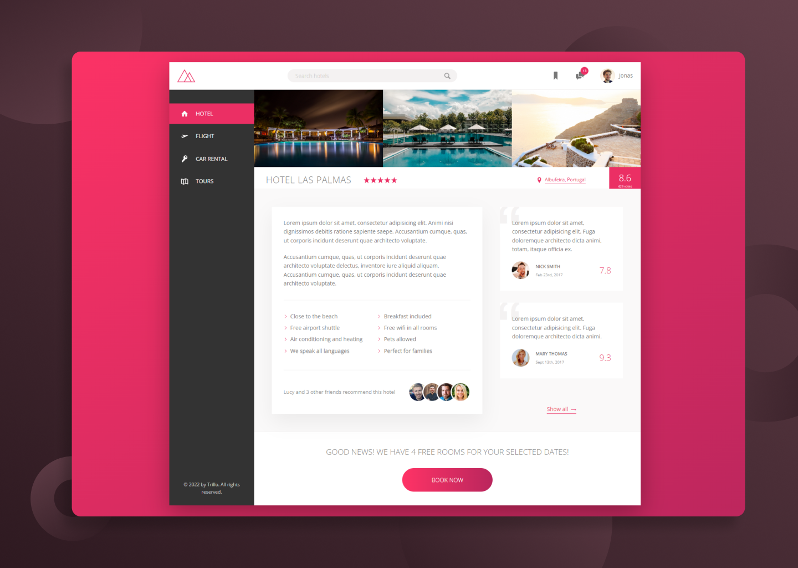

  

    <h1>Trillo</h1>
     
    
A modern and responsive website for a hostel reservation company

    <h3><a href="https://trillo-cem.netlify.app/">🔗 Link to the Website</a></h2>
    
  

## Built with

## Features

- Advanced Flexbox tricks
- Original animations and transitions on hover
- Responsive website

## Context of the Project

This is a part of a Front-End Dev course that i've completed on Udemy
